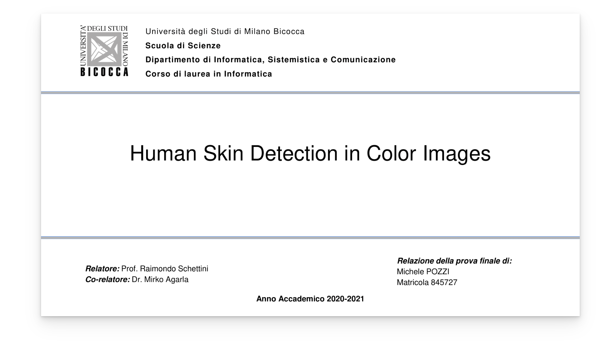

[nbrancati]: https://github.com/123mpozzi/nbrancati "Thresholding approach"
[skin-statistical]: https://github.com/123mpozzi/skin-statistical "Statistical approach"
[skinny]: https://github.com/123mpozzi/skinny "Deep learning approach"
[skinny-bench]: https://github.com/123mpozzi/skinny-bench "Deep learning approach inference times"
[thesis-metrics]: https://github.com/123mpozzi/thesis-metrics "Thesis performance tables"

# Human Skin Detection In Color Images

Bachelor thesis in computer science, written at University of Milano-Bicocca.

    

#### Abstract
Skin detection is the process of discriminating skin and non-skin pixels in an arbitrary
image and represents an intermediate step in several image processing tasks, such as facial analysis and biomedical segmentation. Different approaches have been presented in
the literature, but a comparison is diffcult to perform due to multiple datasets and varying performance measurements. In this work, the datasets and the state-of-the-art approaches are reviewed and categorized using a new proposed taxonomy. Three different
representative skin detector methods of the state of the art are selected and thoroughly
analyzed. This approaches are then evaluated on three different state of the art datasets
and skin tones sub-datasets using multiple metrics. The evaluation is performed on single
and cross dataset scenario to highlight key differences between methods, reporting also
the inference time. Finally, the results are organized into multiple tables, using the related
figures as an assistance tool to support the discussion. Experimental results demonstrate
the strength and weaknesses of each approach, and the need to involve multiple metrics
for a fair assessment of the method’s aspects.

#### Presentation
A quick presentation of the thesis is also available.

    

#### Code

The code used in the thesis is split into separate modules:  

| Module   | Description |
| :---  | :--- |
| [nbrancati]     | Thresholding approach  |
| [skin-statistical]     | Statistical approach  |
| [skinny]     | Deep learning approach  |
| [skinny-bench]     | Deep learning approach inference times  |
| [thesis-metrics]     | Thesis performance tables  |

